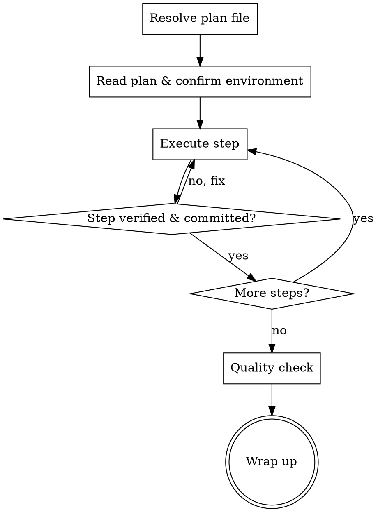

# Work Plan Execution

## Overview

Take a work document (plan, specification, or todo file) and execute it systematically. The focus is on **shipping complete features** by following existing patterns and maintaining quality throughout.

<HARD-GATE>
A step MUST be fully completed, verified, and committed before moving to the next. If a verification item fails, fix it before proceeding. Do NOT skip steps or batch multiple steps into one commit.
</HARD-GATE>

## Anti-Pattern: "I'll Test Everything At The End"

Test after each change, not at the end. Batching tests causes cascading failures that are harder to debug. Continuous testing prevents big surprises.

## Checklist

You MUST create a task for each of these items and complete them in order:

1. **Resolve plan file** - identify and confirm the target plan
2. **Read plan & confirm environment** - understand requirements, note current branch
3. **Execute steps** - implement, test, verify, commit each step sequentially
4. **Quality check** - run full test suite and linting
5. **Wrap up** - update plan status, summarize to user

## Process Flow

## The Process

**Resolving the plan file:**

Argument: `#$ARGUMENTS`

- Date (e.g. `2026-02-21`): match `docs/plans/active/<date>-*.md`
- Keyword (e.g. `authentication`): match `docs/plans/active/*-*<keyword>*.md`
- File path: use directly
- No argument: find the latest `Plan written to docs/plans/active/<filename>.md` in session, confirm with user
- Multiple matches: list and ask user to choose
- Do not proceed until a valid plan file is confirmed

**Reading plan & confirming environment:**
- Read the work document completely and review any references
- The plan is already reviewed and approved — no clarifying questions needed
- Run `git branch --show-current` to note the branch name
- The plan's `## Implementation Steps` checkboxes are the source of truth for progress

**Executing steps:**

For each step in the plan:
1. Read referenced files and look for similar patterns
2. Implement following existing conventions
3. Write tests for new functionality
4. Run tests — all must pass
5. Check off ALL verification items for this step (`[ ]` → `[x]`)
6. Commit with Conventional Commits format, staging only related files
7. Update `## Progress Log` with dated entry for major milestones

**Quality check:**
- Run full test suite and linting/type checking
- Verify all plan checkboxes are checked off
- Confirm code follows existing patterns

**Wrapping up:**
- Update plan frontmatter `status: active` → `status: completed`
- Move plan from `docs/plans/active/` to `docs/plans/completed/` if applicable
- Add final Progress Log entry: `- YYYY-MM-DD: Implementation completed`
- Summarize what was completed and note any follow-up work
- Do **not** push or create a PR automatically — wait for user request

## Key Principles

- **Start fast** - The plan is pre-reviewed; jump straight into execution
- **Follow the plan** - Load referenced code and match existing patterns
- **Test continuously** - Run tests after each change, fix failures immediately
- **Commit per step** - Each completed step gets its own commit
- **Ship complete** - Mark all tasks done; don't leave features 80% finished
