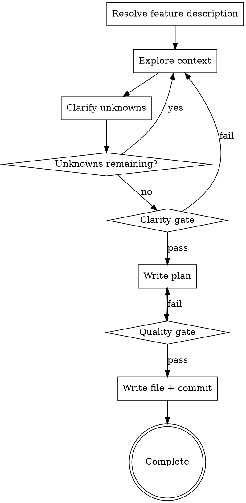

# Create a Plan for a New Feature or Bug Fix

## Overview

Turn a feature description, bug report, or improvement idea into one executable markdown plan.

**Note: The current year is 2026.** Use real dates when naming files and validating recent references.

## Feature Description

<feature_description> #$ARGUMENTS </feature_description>

If the feature description is empty, ask:
"What would you like to plan? Please describe the feature, bug fix, or improvement you have in mind."

Do not proceed without a clear feature description.

<HARD-GATE>
Do NOT write the final plan file until all unknowns are resolved and the clarity gate passes.
Do NOT take implementation actions (no coding, no scaffolding, no implementation skills).
</HARD-GATE>

## Checklist

You MUST complete these tasks in order:

1. **Pass clarity gate** - lock scope, approach, success criteria, and resolve all unknowns
2. **Write and validate plan** - fill template and pass quality gate
3. **Write and commit plan file** - save to `docs/plans/YYYY-MM-DD-<descriptive-name>.md` and commit

## Key Principles

- **Explore before ask** - investigate discoverable facts first; never ask the user for discoverable facts
- **Two kinds of unknowns** - `discoverable fact` (explore) vs `preference/tradeoff` (ask)
- **Ask proactively for preferences** - unresolved `preference/tradeoff` unknowns must be asked
- **One question at a time** - ask one high-impact `preference/tradeoff` question per message
- **Option-first clarification** - when asking, provide 2-4 options with a recommended provisional default
- **Parallel exploration by default** - during Explore context, delegate independent research tracks to subagents in parallel; the main agent coordinates and synthesizes
- **No open unknowns before writing** - pass clarity gate with all `preference/tradeoff` unknowns user-confirmed or explicitly delegated
- **Planning only** - no implementation actions during this skill

## Process Flow

## The Process

**Explore first:**
- Split exploration into independent research tracks and run them via parallel subagents; main agent should focus on coordination and synthesis
- Map entrypoints, data flow, module boundaries, and reusable patterns
- Identify concrete files likely to be created/modified and affected tests
- Review relevant recent commits/reversions for prior decisions and pitfalls
- When external facts materially affect planning decisions, research them early and keep scope tight; prefer primary sources

**Clarify unknowns:**
- Classify each unknown as either `discoverable fact` or `preference/tradeoff`
- Discoverable facts: explore the environment instead of asking
- Preferences/tradeoffs: ask the user with 2-4 options and a recommended provisional default
- If no unresolved `preference/tradeoff` unknowns remain and each one is user-confirmed or explicitly delegated, skip clarification questions and move to the clarity gate
- Ask one question per message; avoid questions answerable by exploration

## Clarity Gate

Do not write the plan until every item passes:

- [ ] Goal and success criteria are explicit
- [ ] Scope is clear (in/out)
- [ ] Approach is chosen with rationale
- [ ] Key tradeoffs are explicitly user-confirmed or explicitly delegated
- [ ] Affected files and code flow are identified
- [ ] High-risk areas are researched
- [ ] No unresolved unknowns or silent defaults remain
- [ ] Implementer will not need to make design decisions

## Plan Template

Use the template at `./PLAN_TEMPLATE.md`.
Do not inline or rewrite a different structure unless the user explicitly asks for a custom format.

## Quality Gate

Verify before writing to disk:

- [ ] Title is clear and searchable
- [ ] No placeholders or TODO text remain
- [ ] Every step has verification criteria
- [ ] Files-to-change table is complete
- [ ] No contradictions across sections
- [ ] Paths/patterns were verified during exploration
- [ ] All checkboxes remain unchecked (`- [ ]`)

## Write and Commit

**Filename:** `docs/plans/YYYY-MM-DD-<descriptive-name>.md` (kebab-case, descriptive)

Examples:
- `docs/plans/2026-02-21-add-user-authentication.md`
- `docs/plans/2026-02-21-fix-checkout-race-condition.md`

After writing the file:
- Stage only the plan file under `docs/plans/` (do not use `git add .`)
- Create one Conventional Commit (recommended: `docs(plan): add <descriptive-name> plan`)

Your task is complete when the plan file is written and committed. Stop there.
